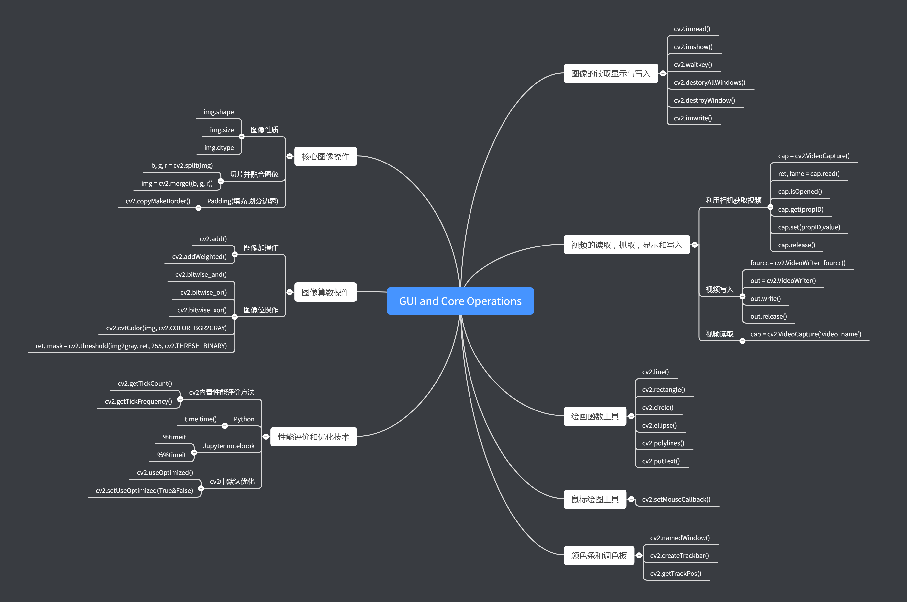
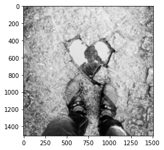
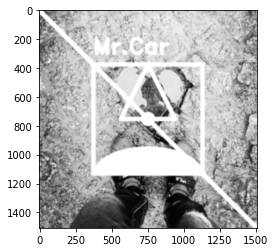
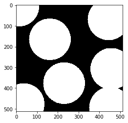
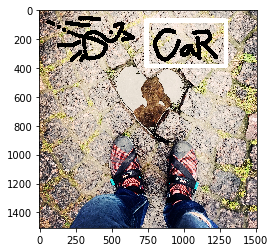
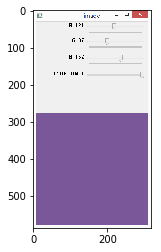
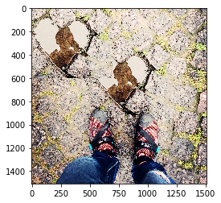
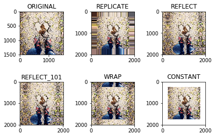
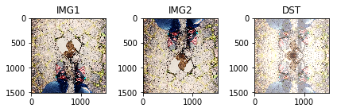
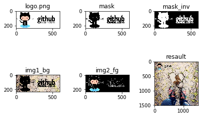

# GUI and Core Operations

内容：

- openCV Python

版本：

- python 3.7.3

- openCV 4.1.0.25

官方文档：

- [tutorial](https://docs.opencv.org/3.1.0/d6/d00/tutorial_py_root.html)

知识点树：



## 0. 应用库的加载


```python
import cv2
import numpy as np
import matplotlib.pyplot as plt
import time

from ipywidgets import interact
```

## 1. 图像的读取，显示与写入

### 图像读取：

`cv2.imread()` 两个参数：

- 注意：路径如果不争确会报错，然后还是会输出None

- 图片路径

- 读片读取的方式

| Flag | 作用 | 简化为 |
| :-: | :-: | :-: |
| cv2.IMREAD_COLOR | 读入彩色区域，透明区域将被忽略 | 1 |
| cv2.IMREAD_GRAYSCALE | 读取成灰度图像 | 0 |
| cv2.IMREAD_UNCHANGED | 读取成彩色区域，包括alpha透明通道 | -1 |

### 图像显示

`cv2.imshow()`:

- 窗口自动适应图片大小

- 第一个参数是窗口名称，第二个参数是要显示的图像

`cv2.waitkey()`:

- 是一个与键盘动作相连的函数，参数是数字，单位是毫秒

- 作用是在特定的时间内等待键盘输入，当键盘输入任意键，程序继续

- 0代表等待时间为无穷，会一直等待键盘输入

`cv2.destroyAllWindows()`:

- 摧毁所有已创建的窗口

`cv2.destroyWindow()`:

- 摧毁某一窗口，参数是窗口名称

### 图像写入（保存）

`cv2.imwrite()` 两个参数：

- 要保存的文件名称

- 图片

### Example

读取灰度图片，按`Esc`键退出窗口，按`s`键保存


```python
img = cv2.imread('img/example.jpg',0)
cv2.imshow('example',img)
k = cv2.waitKey(0)
if k == 27:
    cv2.destroyWindow('example')
if k == ord('s'): #返回Unicode编码
    cv2.imwrite('img/example.png',img)
    cv2.destroyAllWindows()
```

Matplotlib 也可以显示图像，然而需要注意的是OpenCV是以BGR模式显示图像，而plt是以RGB模式显示图像


```python
img = cv2.imread('img/example.jpg',0)
plt.imshow(img, cmap = 'gray', interpolation = 'bicubic')
#plt.xticks([]), plt.yticks([])  # to hide tick values on X and Y axis
plt.show()
```





## 2. 视频的读取，抓取，显示和写入

### 利用相机获取视频

`cap = cv2.VideoCapture()`:

- 首先要创建一个`VideoCapture`对象，参数可以是设备（相机）索引，或者文件名，通常只有一个相机接入，所以参数可以选择0或-1，如果有第二个，第三个设备则可以选择1，2，3等等。接着就可以逐帧抓取视频了，当然最后要释放抓取的内容。

`ret, frame = cap.read()`:

- cap.read()按帧读取视频，ret,frame是获cap.read()方法的两个返回值。其中ret是布尔值，如果读取帧是正确的则返回True，如果文件读取到结尾，它的返回值就为False。frame是每一帧的图像，是个三维矩阵。

`cap.isOpened()`:

- 有的时候cap对象可能因为还没有初始化捕捉画面而报错，在这种情况下，可以通过cap.isOpened()判断是否初始化，如果已经初始化，会返回True，如果返回False可以用 cap.open()初始化。

`cap.get(propID)`：

- 获取video的特征信息，property从0-18

- 可以用`cap.set(propID,value)`改变某一特征的值，例如默认的宽高为640x480，修改为120x120

- cap.set(3,120)改变视频宽度；cap.set(4,120)改变视频高度

`k = cv2.waitkey()`:

- 参数是执行下一个语句前等待的时间，如果改为1000，帧与帧之间就会特别卡顿

### Example

利用相机捕获视频流，键入q退出


```python
cap = cv2.VideoCapture(0)
w,h = cap.get(3),cap.get(4)
print(w,h)
cap.set(3,120)
cap.set(4,120)
while True:
    # Capture frame-by-frame
    ret, frame = cap.read()

    # Our operations on the frame come here
    gray = cv2.cvtColor(frame, cv2.COLOR_BGR2GRAY)

    # Display the resulting frame
    cv2.imshow('frame',gray)
    k = cv2.waitKey(1) #如果改成0 就变成了空格下一帧
    if k == ord('q'):
        break

# When everything done, release the capture
cap.release()
cv2.destroyAllWindows()
```

    640.0 480.0
    

### 视频写入（保存）

首先要创建一个`VideoWriter()`的对象，包括5个参数：

1. 要保存的文件名称

2. FourCC编码

    - FourCC是一个4字节的编码，用来指定文件的编码器，对于不同的操作系统有不同的要求
    
    - FourCC是通过 `cv2.VideoWriter_fourcc('D','I','V','X')`传入的
    
    - 等效于 `cv2.VideoWriter_fourcc(*'DIVX')` 其中 `*` 解包并传入

| 系统 | FourCC | 说明 |
| :-: | :-: | :-: |
| Linux | DIVX, XVID, MJPG, X264, WMV1, WMV2 | XVID更为合适，MJPG会产生很大的文件 X264 会产生非常小的视频文件 |
| Windows | DIVX | 常用的编码类型 |
| OSX | 待补充 | 待补充 |

3. fps(frame per second) #每秒多少帧，正常选择25比较合适，过大会产生卡顿

4. (640,480) #帧的宽与高，结合为元组打包传入

5. colorflag，如果为True则输出为彩色图像，否则输出灰度图像

### Example

利用摄像头捕获图像，沿水平方向翻转（参数为1），若沿垂直方向翻转（参数为0），并写入文件，按q退出


```python
cap = cv2.VideoCapture(0)
fourcc = cv2.VideoWriter_fourcc(*'DIVX')
out = cv2.VideoWriter('example.avi',fourcc,20,(640,480),True)

while cap.isOpened():
    ret,frame = cap.read()
    if ret == True:
        frame = cv2.flip(frame,1)
    
        # write the flipped frame
        out.write(frame)

        cv2.imshow('frame',frame)
        if cv2.waitKey(1) == ord('q'):
            break
    else:
        break

# Release everything if job is finished
cap.release()
out.release()
cv2.destroyAllWindows()
```

### 读取视频文件

- 与抓取类似，也要先创建`cv2.VideoCapture()`对象，参数是视频文件名，使用`cv2.waitkdy()`控制视频的播放速度，一般选择25，调整此参数可以达到快放或慢放的目的

- 整个流程与抓取文件相同

### Example

读取example.avi文件，转为灰度，并展示，设计成按q关闭，然而当视频结束后，`cap.isOpened()`返回False，就自动关闭了。


```python
cap = cv2.VideoCapture('example.avi')
while cap.isOpened():
    ret,frame = cap.read()
    if ret == True:
        gray = cv2.cvtColor(frame,cv2.COLOR_BGR2GRAY)
        cv2.imshow('example.avi',gray)
        k = cv2.waitKey(25)
        if k == ord('q'):
            break
    else:
        break
cap.release()
cv2.destroyAllWindows()
```

## 3. 绘画函数工具

绘图工具包括：

- 线，圆，矩形，椭圆， 文本框

一些共同的参数：

| Arguments | Descrption |
| :-: | :-: |
| img | 想要绘制形状的区域 |
| color | 形状颜色，BGR，以元组传入，eg：(255,0,0) # blue；对于灰度，直接传入灰度数值 |
| thickness | 线或圆的边缘厚度，default = 1，如果设为-1，则会形成封闭图形 |
| lineType | 线型，default = 8-connected，cv2.LINE_AA 对曲线来说比较好 |

Drawing Line

- 在图片上画线需要输入起始点与终点坐标（coordinate n.坐标；adj.协调的）

Drawing Rectangle

- 与 line 相同，左上角与右下角，坐标为像素的行列坐标

Drawing Circle

- 需要圆心坐标和半径

Drawing Ellipse 8个参数：

- img

- 圆心坐标（像素横坐标，像素纵坐标）

- 轴长（横轴半径长，纵轴半径长）

- 偏转角度，逆时针偏转

- 椭圆图形显示区域的起始角度，顺时针

- 椭圆图形显示的终止角度，逆时针

- 边缘颜色（255，255，255）

- 线条粗细，与图形类型

Drawing Polygon

- 首先需要端点的坐标，组成的二维列表，第一个维度是角点，第二个维度是角点的坐标

- 数组类型是 np.int32

- 5个参数：

    - img
    
    - 端点坐标,用一个`[ ]`括起来，作为一个整体
    
    - True 封闭； False 开放
    
    - 颜色，（255，255，255）
    
    - 线条粗细
    
Drawing Text

- 首先要明确字体 `font = cv2.FONT_HERSHEY_SIMPLEX`

- 8个参数：

    - img
    
    - 文本，字符串类型
    
    - 左下角起点坐标
    
    - 字体
    
    - 字号大小
    
    - 颜色，(255,255,255)
    
    - 边缘粗细
    
    - 线型 推荐使用 `lineType = cv2.LINE_AA is recommended`

### Example


```python
img = cv2.imread('img/example.jpg',0)
h,w = img.shape[:2]

# draw line
cv2.line(img,(0,0),(h,w),(255,255,255),30)

# draw rectangle
cv2.rectangle(img,(w//4,h//4),(h*3//4,w*3//4),(255,255,255),30)

# draw circle
cv2.circle(img,(w//2,h//2),50,(255,255,255),-1)

# draw ellipse
cv2.ellipse(img,(w//2,h*3//4),(w//4,h//8),0,180,360,(255,255,255),-1)

# draw polygon
p = np.array([[w//2,h//4],[w*3//8,h//2],[w*5//8,h//2]], np.int32)
cv2.polylines(img,[p],True,(255,255,255),30)

# draw Text
font = cv2.FONT_HERSHEY_DUPLEX
cv2.putText(img,'Mr.Car',(w//4,h//5), font, 5,(255,255,255),20,cv2.LINE_AA)

plt.imshow(img, cmap = 'gray', interpolation = 'bicubic' )
plt.show()
```





## 4. 鼠标绘图工具

### Example 1st

鼠标双击画圆：

- 首先要创建一个鼠标反馈函数，当鼠标动作发生后执行，鼠标动作包括很多，其中有键的按下，抬起，双击等等，鼠标动作返回鼠标动作点所在的坐标。

- 为了让所有鼠标动作都可以激活反馈函数，需要执行如下代码，形成了在`dir(cv2)`中的所有鼠标动作组成的列表，并打印：

cv2.setMouseCallback()：


```python
events = [i for i in dir(cv2) if 'EVENT' in i]
print(events)
```

    ['EVENT_FLAG_ALTKEY', 'EVENT_FLAG_CTRLKEY', 'EVENT_FLAG_LBUTTON', 'EVENT_FLAG_MBUTTON', 'EVENT_FLAG_RBUTTON', 'EVENT_FLAG_SHIFTKEY', 'EVENT_LBUTTONDBLCLK', 'EVENT_LBUTTONDOWN', 'EVENT_LBUTTONUP', 'EVENT_MBUTTONDBLCLK', 'EVENT_MBUTTONDOWN', 'EVENT_MBUTTONUP', 'EVENT_MOUSEHWHEEL', 'EVENT_MOUSEMOVE', 'EVENT_MOUSEWHEEL', 'EVENT_RBUTTONDBLCLK', 'EVENT_RBUTTONDOWN', 'EVENT_RBUTTONUP']
    

创建鼠标反馈函数有具体的格式，如下：

- 定义主体函数（核心函数），5个参数：

    - event：事件
    
    - x：反馈的横坐标
    
    - y：反馈的纵坐标
    
    - flags：旗标
    
    - param：参数
    
- 创建窗口

- 将窗口与主体函数通过`cv2.setMouseCallback('窗口名称'，主体函数)`连接：

    - 一个函数装饰器


```python
# mouse callback function
def draw_circle(event, x, y, flags, param):
    if event == cv2.EVENT_LBUTTONDBLCLK:
        cv2.circle(img,(x,y),100,(255,255,255),-1)

# Create a black image, a window and bind the function to window
img = np.zeros((512,512,3), np.uint8)
cv2.namedWindow('image')
cv2.setMouseCallback('image',draw_circle)

while True:
    cv2.imshow('image',img)
    if cv2.waitKey(20) & 0xFF == 27:
        break
    cv2.imwrite('img/draw_circle.png',img) #实时保存
cv2.destroyAllWindows()
plt.imshow(img)
plt.show()
```





### Example 2nd

实现一个可以鼠绘矩形与圆形的实例，选择模式后就可以通过拖动鼠标实现绘图，这个实例有助于理解像目标跟踪，图片分割等交互应用


```python
drawing = False # true if mouse is pressed
mode = True # if True, draw rectangle. Press 'm' to toggle to curve
ix,iy = -1,-1

# mouse callback function
def draw_circle(event,x,y,flags,param):
    global ix,iy,drawing,mode

    if event == cv2.EVENT_LBUTTONDOWN:
        drawing = True
        ix,iy = x,y

    elif event == cv2.EVENT_MOUSEMOVE:
        if drawing == True:
            if mode == True:
                #cv2.rectangle(img,(ix,iy),(x,y),(255,255,255),-1) #画填充的图形
                pass #画非填充的图形
            else:
                cv2.circle(img,(x,y),15,(0,0,0),-1)

    elif event == cv2.EVENT_LBUTTONUP:
        drawing = False
        if mode == True:
            cv2.rectangle(img,(ix,iy),(x,y),(255,255,255),30)
        else:
            cv2.circle(img,(x,y),15,(0,0,0),-1)
```

接下来要创建窗口并将主函数与窗口绑定起来，同时也需要一个m键来切换绘制矩形与绘制圆形的模式


```python
#img = np.zeros((512,512,3), np.uint8)
img = cv2.imread('img/example.jpg',1)
cv2.namedWindow('image')
cv2.setMouseCallback('image',draw_circle)

while True:
    cv2.imshow('image',img)
    k = cv2.waitKey(1) & 0xFF
    if k == ord('m'):
        mode = not mode
    elif k == 27:
        break
        
cv2.imwrite('img/draw_rectangular.png',img)
cv2.destroyAllWindows()
plt.imshow(img[:,:,::-1]) #反转BGR的方法，让plt.imshow()与cv2.imshow()显示相同
plt.show()
```





## 5. 颜色条和调色板

### Example

将颜色条窗体连接起来，用到两个函数`cv2.getTrackbarPos()`, `cv2.createTrackbar()`

`cv2.createTrackbar()` 5个参数:

- '颜色条名称'

- '与其绑定的窗体名称'

- 默认值

- 最大值

- 反馈函数：
    
    - 每次颜色条值改变后执行
    
    - 默认的反馈函数是返回颜色条的位置

    
`cv2.getTrackbarPos()` 2个参数：

- 'Trackbar名称'
    
- '窗口名称'
   
颜色条的另一个功能是充当按钮，OpenCV中并没有按钮，所以颜色条可以充当一个开关

样例：

- 创建一个颜色条充当程序的开关

- 创建三条颜色条，对应BGR三通道的数值强度，可以拖动颜色条控制窗体的颜色


```python
def nothing(x):
    pass

# Create a black image, a window
img = np.zeros((300,300,3), np.uint8)
cv2.namedWindow('image')

# create trackbars for color change
cv2.createTrackbar('R','image',0,255,nothing)
cv2.createTrackbar('G','image',0,255,nothing)
cv2.createTrackbar('B','image',0,255,nothing)

# create switch for ON/OFF functionality
switch = '0 : OFF \n1 : ON'
cv2.createTrackbar(switch, 'image',0,1,nothing)

while(1):
    cv2.imshow('image',img)
    k = cv2.waitKey(1) & 0xFF
    if k == 27:
        break

    # get current positions of four trackbars
    r = cv2.getTrackbarPos('R','image')
    g = cv2.getTrackbarPos('G','image')
    b = cv2.getTrackbarPos('B','image')
    s = cv2.getTrackbarPos(switch,'image')

    if s == 0:
        img[:] = 0
    else:
        img[:] = [b,g,r]

cv2.destroyAllWindows()
img = cv2.imread('img/trackbar.png')
plt.imshow(img[:,:,::-1])
plt.show()
```





用 jupyter 的扩展插件可以形成更漂亮的交互界面：

- 首先要加载库：`from ipywidgets import interact`


```python
def f(On,b,g,r):
    img = np.zeros((300,300,3),np.uint8)
    if On:    
        img[:,:] = [r,g,b]
    plt.imshow(img)
    plt.show()
    return
# Generate a slider 
interact(f,On = True,b = (0,255),g = (0,255),r = (0,255))
pass
```


    interactive(children=(Checkbox(value=True, description='On'), IntSlider(value=127, description='b', max=255), …


## 6. 核心图像操作

目标：

- 访问和修改像素值

- 访问图像特征（性质）

- 设置图像区域 Region of Image (ROI)

- 分割并融合图像

- Padding（填充，划分边界）

### 访问和修改像素值

简单的读取图像，通过索引访问，并且赋值。

注意：

- numpy是一个经过优化的数组操作的库，循环逐一地访问像素并且修改非常慢

### 访问图像性质

`img.shape`：

- 返回一个元组(300,200,3)

- 像素点的行数，列数，通道数

- 一般通过 `h,w = img.shape[:2]` 来获取图像的宽高坐标

- 如果是灰度图像，只会返回两个元素的元组，没有通道数

`img.size`：

- 总的像素点个数

`img.dtype`

- 图像的数据类型 eg：`uint8`

- 图像的数据类型在调试的时候非常重要，OpenCV Python 大量的错误都是由无效的数据类型引起的。

### 图像区域（感兴趣区域）ROI

通常情况下，图像处理要选定图像特定区域，例如人脸识别项目中，会首先框出人脸区域，然后在人脸区域中选定人眼区域，恰当的选择ROI可以提高精度，从而提高准确率。ROI的获取要通过img索引

- `img[280:340, 330:390]` #宽度像素从280:340,高度像素从330:390的区域

Example 移花接木：


```python
img = cv2.imread('img/example.jpg',1)
heart = img[300:900,500:1200]
img[0:600,0:700] = heart
plt.imshow(img[:,:,::-1])
plt.show()
```





### 分割（切片）并融合图像

有时候对于图像而言需要分别在 BGR 通道上进行操作，所以要将图片分割为三个通道，操作结束后还要将三通道合并为一张图像：

- `b,g,r = cv2.split(img)`

- `img = cv2.merge((b,g,r))`

或者用 numpy 索引：

- `b = img[:,:,0]`

`cv2.split()`是一个很开销很大的方法，如非玩不得己，还是最好用np索引

### padding（填充 划分边界）

`cv2.copyMakeBorder()`：

- 如果想在图像周围创建一个像相框一样的边界可以使用此函数

- 其更为主要的应用是卷积操作与0值填充等，函数参数如下：

- `src` - img

- `top, bottom, left, right` - 边界内卷的值

- `borderType` - Flag 定义了如下边界类型

| Flag | 说明 |
| :-: | :-: |
| cv2.BORDER_CONSTANT | 添加常量边界，值由下一个参数给出 |
| cv2.BORDER_REFLECT | 边界值会镜像反射边界元素，如 :`fedcba  abcdefgh  hgfedcb` |
| cv2.BORDER_REFLECT_101 or cv2.BORDER_DEFAULT | 与上一个相似，但有细微差别，如:`gfedcb  abcdefgh  gfedcba` |
| cv2.BORDER_REPLICATE | 最后的元素会被复制,如: `aaaaaa  abcdefgh  hhhhhhh` |
| cv2.BORDER_WRAP | 不好解释，如: `cdefgh  abcdefgh  abcdefg` |

- `value` - Color of border if border type is cv2.BORDER_CONSTANT


```python
BORDER = [250,250,250,250,] #上下左右边界厚度
WHITE = [255,255,255] # value 参数值
img1 = cv2.imread('img/example.jpg')

img1 = img1[:,:,::-1] #转化为RGB

replicate = cv2.copyMakeBorder(img1,*BORDER,cv2.BORDER_REPLICATE)
reflect = cv2.copyMakeBorder(img1,*BORDER,cv2.BORDER_REFLECT)
reflect101 = cv2.copyMakeBorder(img1,*BORDER,cv2.BORDER_REFLECT_101)
wrap = cv2.copyMakeBorder(img1,*BORDER,cv2.BORDER_WRAP)
constant= cv2.copyMakeBorder(img1,*BORDER,cv2.BORDER_CONSTANT,value=WHITE)

fig = plt.figure() #自动调整布局

plt.subplot(231),plt.imshow(img1,'gray'),plt.title('ORIGINAL')
plt.subplot(232),plt.imshow(replicate,'gray'),plt.title('REPLICATE')
plt.subplot(233),plt.imshow(reflect,'gray'),plt.title('REFLECT')
plt.subplot(234),plt.imshow(reflect101,'gray'),plt.title('REFLECT_101')
plt.subplot(235),plt.imshow(wrap,'gray'),plt.title('WRAP')
plt.subplot(236),plt.imshow(constant,'gray'),plt.title('CONSTANT')

fig.tight_layout() #自动调整布局

plt.show()
```





## 7. 算术图像操作

目标：

- 掌握图像的加减与位操作

- 相关函数：`cv2.add()`, `cv2.addWeighted()`等

### 图像的加操作

可以通过`cv2.add()`函数将两个图像进行加和，或者简单的np加和操作也可，两张图像需要有相同的数据类型和尺寸，或者第二张图片是纯量值（scalar value）

- `cv2.add()`是一个饱和的操作，如果是 np.uint8 加和结果最多为 255,而简单np加和则可以超过 255

- `cv2.add()`的两个参数：

    - 第一个 img
    
    - 第二个 img
    
OpenCV 函数有更好的表现，建议使用 `cv2.add()`

**图像混合（加权相加）**：

$$g(x) = (1 - \alpha)f_0(x) + \alpha f_1(x)$$

- $\alpha$在（0，1）之间变化可以实现两张图像的叠加

- 需要用到 `cv2.addWeighted()` 公式如下：

$$dst = \alpha \cdot img1 + \beta \cdot img2 + \gamma$$

Example:


```python
img1 = cv2.imread('img/example.jpg',1)
img1 = img1[:,:,::-1]
img2 = img1[::-1,:]

fig = plt.figure()

plt.subplot(131),plt.imshow(img1),plt.title('IMG1')
plt.subplot(132),plt.imshow(img2),plt.title('IMG2')
#最后一个参数相当于调高了量度
plt.subplot(133),plt.imshow(cv2.addWeighted(img1,0.5,img2,0.5,50)),plt.title('DST')

fig.tight_layout()
plt.show()
```





### 图像的位操作

包括`AND,OR,NOT,XOR`操作，这些操作在后续章节中抽取图像特征环节非常重要且实用

- 与：两个都为真才是真，`cv2.bitwise_and(img1, img2, mask)`

- 或：有一个为真就是真，`cv2.bitwise_or(img1, img2, mask)`

- 异或：两者不同为真，`cv2.bitwise_xor(img1, img2, mask)`

- 非：原先为假结果就是真，原先为真结果就是假，`cv2.bitwise_not(img1,mask)`

`mask`掩膜:

- 上面的函数最后一项都为mask，这就是掩膜，具体作用就是真正要进行操作的区域，因为大多数时候我们并不需要对整个图像进行操作。

- 掩膜的大小与原图像相同，为二值图像，真正要操作的区域就是掩膜图像中的非零部分（即灰度值为255的部分）

`cv2.cvtColor(img2,cv2.COLOR_BGR2GRAY)`转换彩色图像为灰度，两个参数：

- img 彩色

- `cv2.COLOR_BGR2GRAY` Flag

`ret, mask = cv2.threshold(img2gray, 250, 255, cv2.THRESH_BINARY)`：

- 两个返回值：

    - 阈值value
    
    - mask蒙版
    
- 四个参数：

    - img gray 灰度图像
    
    - value 阈值
    
    - value 填充值
    
    - `cv2.THRESH_BINARY`：大于阈值处置为填充值，小于阈值处置为0


```python
# Load two images
img1 = cv2.imread('img/example.jpg')
img2 = cv2.imread('img/logo.jpg')

fig = plt.figure()

# I want to put logo on top-left corner, So I create a ROI
rows,cols,channels = img2.shape
roi = img1[50:50+rows, 50:50+cols ]

# Now create a mask of logo and create its inverse mask also
img2gray = cv2.cvtColor(img2,cv2.COLOR_BGR2GRAY)
ret, mask = cv2.threshold(img2gray, 250, 255, cv2.THRESH_BINARY)
#打印阈值，超过阈值为255，低于阈值为0，由于原图存在白色背景，所以为了滤除背景，阈值选择250，接近白色
print(ret) 
mask_inv = cv2.bitwise_not(mask)

plt.subplot(231),plt.imshow(img2[:,:,::-1]),plt.title('logo.png')
plt.subplot(232),plt.imshow(mask,cmap='gray'),plt.title('mask')
plt.subplot(233),plt.imshow(mask_inv,cmap='gray'),plt.title('mask_inv')

# Now black-out the area of logo in ROI
img1_bg = cv2.bitwise_and(roi,roi,mask = mask)

plt.subplot(234),plt.imshow(img1_bg[:,:,::-1]),plt.title('img1_bg')

# Take only region of logo from logo image.
img2_fg = cv2.bitwise_and(img2,img2,mask = mask_inv)

plt.subplot(235),plt.imshow(img2_fg[:,:,::-1]),plt.title('img2_fg')

# Put logo in ROI and modify the main image
dst = cv2.add(img1_bg,img2_fg)
img1[50:50+rows, 50:50+cols ] = dst

plt.subplot(236),plt.imshow(img1[:,:,::-1]),plt.title('resault')

fig.tight_layout()
plt.show()
```

    250.0
    





## 8. 性能评价和优化技术

图像处理需要进行大量的数据运算，所以代码必须要有很好的性能，目标：

- 测量代码性能

- 优化技巧

- `cv2.getTickCount`, `cv2.getTickFrequency etc`

Pyhton 的 time 模块 可以测量代码运行时间，profile 模块 可以显示代码运行细节，如代码块中每一个函数运行的时间，每一个函数调用的次数等等。jupyter 有更易用的类似方法

### OpenCV 内置的性能评价方法

`cv2.getTickCount()`:

- 返回代码块运行的时钟循环次数

`cv2.getTickFrequency()`

- 返回时钟循环的频率

Example：


```python
e1 = cv2.getTickCount()

# your code execution
img = cv2.imread('img/example.jpg')
for i in range(5,49,2):
    img = cv2.medianBlur(img,i)

e2 = cv2.getTickCount()

t = (e2 - e1)/ cv2.getTickFrequency()
print(t)
```

    10.671957467268697
    

Python 的 time 模块可以起到同样的效果：

- `start = time.time()`

- `finish = time.time()`

- `t = finish - star`


```python
e1 = time.time()

# your code execution
img = cv2.imread('img/example.jpg')
for i in range(5,49,2):
    img = cv2.medianBlur(img,i)

e2 = time.time()

t = e2 - e1
print(t)
```

    10.699588537216187
    

### OpenCV 中的默认优化方式

OpenCV 中的许多函数用了 SSE2, AVX etc 方式优化。其中也有未经优化的函数：

- `cv2.useOptimized()` 查看是否开启优化

- `cv2.setUseOptimized(True&False)` 开启或关闭优化


```python
#duru wenjan
img = cv2.imread('img/example.jpg')

#关闭优化
cv2.setUseOptimized(False)
print('是否开启优化：',cv2.useOptimized())
%timeit res = cv2.medianBlur(img,49)

#开启优化
cv2.setUseOptimized(True)
print('是否开启优化：',cv2.useOptimized())
%timeit res = cv2.medianBlur(img,49)
```

    是否开启优化： False
    323 ms ± 10.1 ms per loop (mean ± std. dev. of 7 runs, 1 loop each)
    是否开启优化： True
    787 ms ± 24.8 ms per loop (mean ± std. dev. of 7 runs, 1 loop each)
    

### Jupyter 魔术方法测量代码性能

`%timeit` + 单行代码

`%%timeit` + 多行代码

返回分析报告，多次循环的平均值和标准差

Example:

- 比较不同种乘法操作的性能：

    - `x = 5; y = x**2`
    - `x = 5; y = x*x`
    - `x = np.uint8([5]);y = x*x or y = np.square(x)`


```python
x = 5
%timeit y = x**2
%timeit y = x*x
%timeit y = np.square(x)

z = np.uint8(5)
%timeit y = z*z
%timeit y = np.square(z)
```

    345 ns ± 10.3 ns per loop (mean ± std. dev. of 7 runs, 1000000 loops each)
    61.9 ns ± 1.48 ns per loop (mean ± std. dev. of 7 runs, 10000000 loops each)
    898 ns ± 45.7 ns per loop (mean ± std. dev. of 7 runs, 1000000 loops each)
    88.8 ns ± 1.98 ns per loop (mean ± std. dev. of 7 runs, 10000000 loops each)
    1.24 µs ± 16.5 ns per loop (mean ± std. dev. of 7 runs, 1000000 loops each)
    

- 可以看到，`x = 5 ; y = x*x` 是最快的，并且大约是Numpy的20倍

- 如果把创建数组时间也考虑进去，可以快上100倍

- **(Numpy 开发者正在致力于解决这个问题)**

Python 纯量操作要快于 Numpy 纯量操作。所以当只有几个元素需要操作时，最好使用 Python 纯量而不是 Numpy array， Numpy 在 数组规模很大时才会占据优势

Example：

- 比较cv2的方法和np方法的快慢（cv2性能要更好,快了三个数量级）

- `cv2.countNonZero()` and `np.count_nonzero()` 对同一个 img 的速度

- 通常情况下cv2的方法比np方法要快，但是也存在特例，用np索引预览时就很快


```python
img = cv2.imread('img/example.jpg',0)
%timeit z = cv2.countNonZero(img)
%timeit z = np.count_nonzero(img)
```

    118 µs ± 1.71 µs per loop (mean ± std. dev. of 7 runs, 10000 loops each)
    4.21 ms ± 420 µs per loop (mean ± std. dev. of 7 runs, 100 loops each)
    

### 更多的 Jupyter 魔术方法

有很多测量代码性能的魔术方法，如 profiling，line profiling，memory measurement 等，合理利用可以事半功倍：

- [说明文档 timeing and profiling](https://pynash.org/2013/03/06/timing-and-profiling/)

### 程序性能优化技巧

- [牛逼文档 Python Optimization Techniques](https://wiki.python.org/moin/PythonSpeed/PerformanceTips)

- [进阶文档 Advanced NumPy](http://scipy-lectures.org/advanced/advanced_numpy/index.html)

这段话太经典了放上原文：

The main thing to be noted here is that, first try to implement the algorithm in a **simple manner**(简单方式实现). Once it is working, **profile it**(剖析), find the bottlenecks and **optimize them**(优化瓶颈).

- Avoid using loops in Python as far as possible, especially double/triple loops etc. They are inherently slow.

- 避免使用循环，尤其是多重循环

- Vectorize the algorithm/code to the maximum possible extent because Numpy and OpenCV are optimized for vector operations. 

- 最大程度地向量化算法，因为 OpenCV 与 Np 都是为向量化而优化的

- Exploit the cache coherence. 

- 利用相关缓存（用空间换时间？）

- Never make copies of array unless it is needed. Try to use views instead. Array copying is a costly operation. 

- 除非万不得已，不要拷贝数组，尝试用索引预览替代
