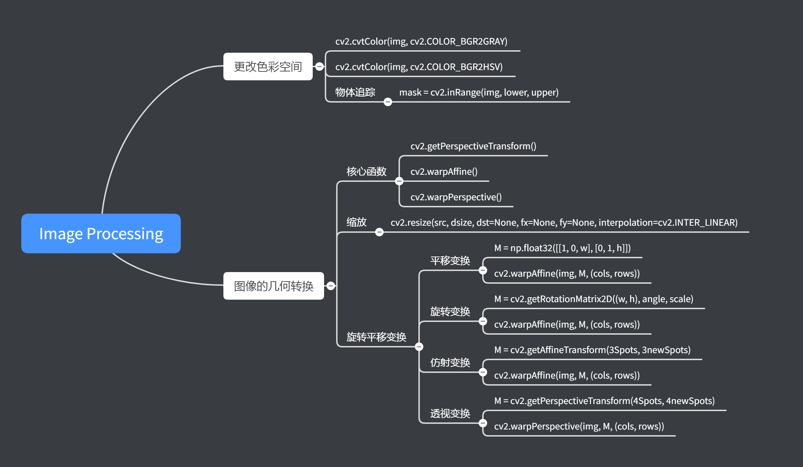
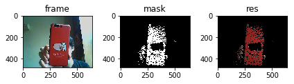
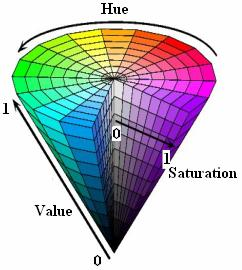
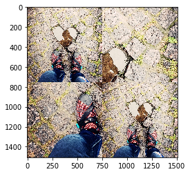
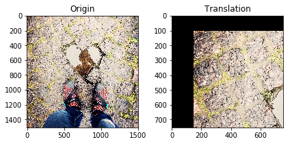
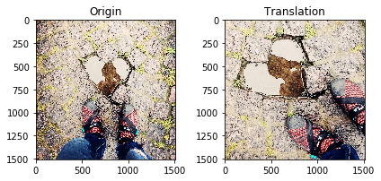
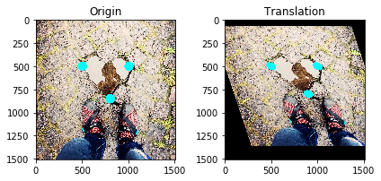
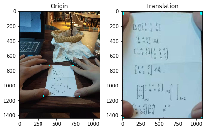

# Image Processing

内容：

- openCV Python

版本：

- python 3.7.3

- openCV 4.1.0.25

官方文档：

- [tutorial](https://docs.opencv.org/3.1.0/d6/d00/tutorial_py_root.html)

知识点树：



## 0. 应用库的加载


```python
import cv2
import numpy as np
import matplotlib.pyplot as plt
import time

from ipywidgets import interact
```

## 1. 更改色彩空间

目标：

- 学习转换图片从一个色彩空间到另一个色彩空间，如 BGR ↔ Gray, BGR ↔ HSV 等

- 在此基础上，创建一个应用用于在video中抽取一个带颜色的物体 

- `cv2.cvtColor()`, `cv2.inRange()`

cv2 中有超过150种色彩空间转换的方式，其中最为广泛应用的两种就是 BGR ↔ Gray and BGR ↔ HSV

- cv2.cvtColor(input_image, flag)：

    - flag 决定了转换方式

    - BGR → Gray ：`cv2.COLOR_BGR2GRAY`
    
    - BGR → HSV ：`cv2.COLOR_BGR2HSV`
    
        - 对于 HSV，Hue 范围在（0，179），Saturation 范围在（0，255），Value 范围在（0，255）
        
        - 不同的软件用不同的规模，如果需要将 OpenCV 与其他软件的值对比需要规范化这些范围
    
所有色彩空间转换的 flags：


```python
flags = [i for i in dir(cv2) if i.startswith('COLOR_')]
print(flags[:10],'...')
```

    ['COLOR_BAYER_BG2BGR', 'COLOR_BAYER_BG2BGRA', 'COLOR_BAYER_BG2BGR_EA', 'COLOR_BAYER_BG2BGR_VNG', 'COLOR_BAYER_BG2GRAY', 'COLOR_BAYER_BG2RGB', 'COLOR_BAYER_BG2RGBA', 'COLOR_BAYER_BG2RGB_EA', 'COLOR_BAYER_BG2RGB_VNG', 'COLOR_BAYER_GB2BGR'] ...
    

### 物体追踪

在将 BGR 转化为 HSV 之后，就可以进行颜色物体追踪了，在 HSV 空间中更容易表示颜色，提取颜色物体的方法如下：

- 逐帧地抽取视频

- BGR → HSV

- 设定阈值在一个颜色的范围

- 抽取出的目标物体

Example：

- 颜色物体追踪（Blue）


```python
cap = cv2.VideoCapture(0)

while True:

    # Take each frame
    ret,frame = cap.read()
    if ret == True:
        # Convert BGR to HSV
        
        hsv = cv2.cvtColor(frame, cv2.COLOR_BGR2HSV)

        # define range of blue color in HSV
        lower_red = np.array([0,43,46])
        upper_red = np.array([10,255,255])

        # Threshold the HSV image to get only blue colors
        mask = cv2.inRange(hsv, lower_red, upper_red)

        # Bitwise-AND mask and original image
        res = cv2.bitwise_and(frame,frame, mask= mask)

        cv2.imshow('res',res)
        k = cv2.waitKey(50) & 0xFF
        if k == 27:
            break
    else:
        break
cap.release()
cv2.destroyAllWindows()

fig = plt.figure()
plt.subplot(131),plt.imshow(frame[:,:,::-1]),plt.title('frame')
plt.subplot(132),plt.imshow(mask,cmap='gray'),plt.title('mask')
plt.subplot(133),plt.imshow(res[:,:,::-1]),plt.title('res')
fig.tight_layout()
plt.show()
```





- 图片中有许多噪声，接下来会有许多方式去除这些噪声

- 物体追踪技术中，这是最简单方法。利用轮廓函数可以对图像做许多操作，如寻找到物体形心并用其追踪物体，在镜头前移动手指画出图形，其他种种

### 查找HSV值

- [stackoverflow.com](https://stackoverflow.com/)

HSV值对应颜色参照表：


HSV空间示意图：



`cv2.cvtColor()`可以将某一个BGR值转为HSV值：

Example：将绿色由BGR转为HSV值


```python
green = np.uint8([[[0,255,0]]])
cv2.cvtColor(green,cv2.COLOR_BGR2HSV)
```


    array([[[ 60, 255, 255]]], dtype=uint8)


## 2. 图像的几何转换

图像的几何转换包括：

- 缩放

- 旋转

- 仿射变换

核心函数：

- `cv2.getPerspectiveTransform()`

- `cv2.warpAffine()`

    - $2 \times 3$ 仿射矩阵

- `cv2.warpPerspective()`

    - $3 \times 3$ 透视矩阵
    
### 缩放

缩放是重新定义图像尺寸，核心函数是：

- `cv2.resize(src,dsize,dst=None,fx=None,fy=None,interpolation=None)`

    - 图像尺寸可以手工指定，也可以定义缩放因子，指定不同的插值方式
    
    - `src` img
    
    - `dsize` 目标图像尺寸()
    
    - `dst=None` 
    
    - `fx=None` x轴缩放系数
    
    - `fy=None` y轴缩放系数
    
    - `interpolation=None` 插值方式
    
- 常用的插值方式为：

    - `cv2.INTER_AREA` 用于缩小
    
    - `cv2.INTER_CUBIC` (slow) & `cv2.INTER_LINEAR` 用于放大
    
    - `cv2.INTER_LINEAR` 为默认的插值方式

Example：

- 缩放图片


```python
img = cv2.imread('img/example.jpg')
h, w = img.shape[:2]

#利用因子缩放得到res
res = cv2.resize(img,None,fx=0.5, fy=0.5, interpolation = cv2.INTER_CUBIC)

#直接定义尺寸缩放得到res1
res1 = cv2.resize(img,(w//2, h//2), interpolation = cv2.INTER_CUBIC)

#将res放在img左上角
img[0:h//2+1,0:w//2+1] = res

#将res1放在img右下角
img[h//2+1:h,w//2+1:w] = res1

plt.imshow(img[:,:,::-1])
plt.show()
```





### 旋转平移变换

平移变换是移动了物体的方位：

- 如果在$(x，y)$方向上的移动范围是$(t_x,t_y)$

- 创建变换矩阵$M$

$$M = 
\left[
\begin{matrix}
1 & 0 & t_x \\
1 & 0 & t_y \\
\end{matrix}
\right]$$

Example：图像平移

`cv2.warpAffine(img,M,(cols,rows))`:

- `img`

- `M` 变换矩阵

- `(cols,rows)` 输出图片的大小，要注意是**(widths,heights)** ，$widths = number of cols；heights = number of rows$


```python
img = cv2.imread('img/example.jpg')
rows,cols = img.shape[:2]

M = np.float32([[1,0,150],[0,1,100]])
dst = cv2.warpAffine(img,M,(cols//2,rows//2))

fig = plt.figure()

plt.subplot(121),plt.imshow(img[:,:,::-1]),plt.title('Origin')
plt.subplot(122),plt.imshow(dst[:,:,::-1]),plt.title('Translation')

fig.tight_layout()
plt.show()
```





### 旋转变换

旋转变换是将图像旋转一定角度：

- 如果角度为$\theta$

- 创建变换矩阵$M$

$$M = 
\left[
\begin{matrix}
cos \theta  & -sin \theta  \\
sin \theta  & cos \theta
\end{matrix}
\right]$$

cv2可以自定义旋转中心，还可以缩放与旋转一起完成：

- 创建变换矩阵$M$

$$
\begin{bmatrix}
\alpha & \beta & (1- \alpha ) \cdot center.x - \beta \cdot center.y \\
- \beta & \alpha & \beta \cdot center.x + (1- \alpha ) \cdot center.y 
\end{bmatrix}$$

- where

$$\begin{array}{l} \alpha = scale \cdot \cos \theta , \\ \beta = scale \cdot \sin \theta \end{array}$$

cv2提供了`cv2.getRotationMatrix2D()`函数，来获得这个变换矩阵

Example:以型心为中心，旋转45度，放大1.5倍

- M = `cv2.getRotationMatrix2D((cols/2,rows/2),45,1.5)`

    - `(w, h)` 旋转中心
    
    - `45` 逆时针旋转的度数
    
    - `1.5` 放大倍数


```python
img = cv2.imread('img/example.jpg')
h, w = img.shape[:2]

M = cv2.getRotationMatrix2D((cols/2,rows/2),45,1.5)
dst = cv2.warpAffine(img,M,(cols,rows))

fig = plt.figure()

plt.subplot(121),plt.imshow(img[:,:,::-1]),plt.title('Origin')
plt.subplot(122),plt.imshow(dst[:,:,::-1]),plt.title('Translation')

fig.tight_layout()
plt.show()
```





### 仿射变换

在仿射变换中，所有原图中的平行行在输出图片中依然会平行：

- 确定原图中的三个定位点坐标

- 确定它们在输出图片中的位置

- `cv2.getAffineTransform()` 将会创建一个$2 \times 3$的矩阵

- 这个矩阵将被传入 `cv2.warpAffine()`


```python
img = cv2.imread('img/example.jpg')
rows,cols,ch = img.shape

#在原图中标注三个点
pts1 = np.float32([[500,500],[1000,500],[800,850]])
for each in pts1:
    cv2.circle(img,tuple(each),50,[255,255,0],-1)

#指定输出图片中三个点对应的位置
pts2 = np.float32([[500,500],[1000,500],[900,800]])

#得到仿射矩阵
M = cv2.getAffineTransform(pts1,pts2)

#进行仿射变换
dst = cv2.warpAffine(img,M,(cols,rows))
fig = plt.figure()

plt.subplot(121),plt.imshow(img[:,:,::-1]),plt.title('Origin')
plt.subplot(122),plt.imshow(dst[:,:,::-1]),plt.title('Translation')

fig.tight_layout()
plt.show()
```





### 透视变换

- 透视变换矩阵是$3 \times 3$

- 在透视变换后直线仍然是直线

- 得到透视矩阵需要在原图中定位4个点，并且知道这些点在输出图片中的坐标

- 4个点中任意三点不可共线

通过`cv2.getPerspectiveTransform()`得到透视矩阵

然后将其应用于`cv2.warpPerspective()`


```python
#mousecallback 函数
pts1 = []
def find_4_spots(event,x,y,flags,param):
    global pts1
    if event == cv2.EVENT_LBUTTONDOWN:
        cv2.circle(img,(x,y),10,(255,255,0),-1)
        pts1.append([x,y])
        
#读入img 并创建窗口，将函数与窗口绑定        
img = cv2.imread('img/Perspective.jpg')
h, w = img.shape[:2]
cv2.namedWindow('PerspectiveTransform',0)
cv2.setMouseCallback('PerspectiveTransform',find_4_spots)


while True:
    cv2.imshow('PerspectiveTransform',img)
    cv2.waitKey(20)
    if len(pts1)==4:
        break
cv2.destroyAllWindows()

pts1 = np.float32(pts1)
pts2 = np.float32([[0,0],[w,0],[0,h],[w,h]])

M = cv2.getPerspectiveTransform(pts1,pts2)

dst = cv2.warpPerspective(img,M,(w,h))
fig = plt.figure()

plt.subplot(121),plt.imshow(img[:,:,::-1]),plt.title('Origin')
plt.subplot(122),plt.imshow(dst[:,:,::-1]),plt.title('Translation')

fig.tight_layout()
plt.show()
```





### 经典原著

- "Computer Vision: Algorithms and Applications"-Richard Szeliski
