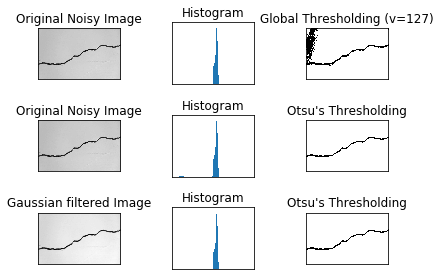

# Image Thresholding Smoothing

内容：

- openCV Python

版本：

- python 3.7.3

- openCV 4.1.0.25

官方文档：

- [tutorial](https://docs.opencv.org/3.1.0/d6/d00/tutorial_py_root.html)

知识点树：


## 0. 应用库的加载


```python
import cv2
import numpy as np
import matplotlib.pyplot as plt
import time

from ipywidgets import interact
```

目标：

- 学习简单的阈值处理，自适应的阈值化，Otsu's阈值化等

- 核心函数有 `cv2.threshold()`, `cv2.adaptiveThreshold()`

## 1. 简单二值化

如果像素值高于某一个阈值，就设置其为“1”（白色），否则就设置其为黑色

`cv2.threshold()`:

- img 灰度图像

- 阈值value

- maxVal 填充值

- Flags

| Flags | 说明 |
| :-: | :-: |
| cv2.THRESH_BINARY | 大于阈值的点设为填充值，否则设为0 |
| cv2.THRESH_BINARY_INV | 大于阈值的点设为0，否则设为填充值 |
| cv2.THRESH_TRUNC | 大于阈值的点设为填充值，否则为原图 |
| cv2.THRESH_TOZERO | 大于阈值的点为原图，否则为0 |
| cv2.THRESH_TOZERO_INV | 大于阈值的点为0，否则为原图 |

- 两个返回值：

    - retal是阈值value
    
    - frame是返回图像


```python
img = cv2.imread('img/gradient.jpg',0)

ret,thresh1 = cv2.threshold(img,127,255,cv2.THRESH_BINARY)
ret,thresh2 = cv2.threshold(img,127,255,cv2.THRESH_BINARY_INV)
ret,thresh3 = cv2.threshold(img,127,255,cv2.THRESH_TRUNC)
ret,thresh4 = cv2.threshold(img,127,255,cv2.THRESH_TOZERO)
ret,thresh5 = cv2.threshold(img,127,255,cv2.THRESH_TOZERO_INV)

titles = ['Original Image','BINARY','BINARY_INV','TRUNC','TOZERO','TOZERO_INV']
images = [img, thresh1, thresh2, thresh3, thresh4, thresh5]


for i in range(6):
    plt.subplot(2,3,i+1),plt.imshow(images[i],'gray')
    plt.title(titles[i])
    plt.xticks([]),plt.yticks([])

plt.show()
```


## 2. 适应性二值化

一个全局的阈值二值化的效果不会很好，因为有光照强度对图片像素值的影响，这种情况下需要自适应的阈值化技术：

- 算法计算一小块区域的阈值

- 根据不同阈值对相应区域进行处理

`cv2.adaptiveThreshold()`有三个特殊的参数，只有一个返回值

- `Adaptive Method` 决定阈值的计算方式

    - `cv2.ADAPTIVE_THRESH_MEAN_C` 阈值是相邻区域的均值

    - `cv2.ADAPTIVE_THRESH_GAUSSIAN_C` 阈值是相邻区域的加权之和的平均数，权重是高斯分布的概率
    
- `Block Size` 决定相邻区域的尺寸

- `C` 是一个从均值或者加权均值中减去的常数


```python
img = cv2.imread('img/liefeng.jpg',0)
#中值滤波 Blur模糊
img = cv2.medianBlur(img,5)

ret,th1 = cv2.threshold(img,127,255,cv2.THRESH_BINARY) #120的效果最好，直接滤掉
th2 = cv2.adaptiveThreshold(img,255,cv2.ADAPTIVE_THRESH_MEAN_C,\
            cv2.THRESH_BINARY,11,2)
th3 = cv2.adaptiveThreshold(img,255,cv2.ADAPTIVE_THRESH_GAUSSIAN_C,\
            cv2.THRESH_BINARY,11,2)

titles = ['Original Image', 'Global Thresholding (v = 127)',
            'Adaptive Mean Thresholding', 'Adaptive Gaussian Thresholding']
images = [img, th1, th2, th3]

fig = plt.figure()
for i in range(4):
    plt.subplot(2,2,i+1),plt.imshow(images[i],'gray')
    plt.title(titles[i])
    plt.xticks([]),plt.yticks([])
fig.tight_layout()
plt.show()
```


## 3. Otsu’s 二值化

在全域二值化过程中，如何保证选取的值最合理呢？需要进一步的搜索。考虑到一个二峰值的图像（简单来说就是这个图像的像素统计直方图有两个峰），这样的图像只要选取两峰中间的谷处就可以了，这就是 Otsu's 二值化，简单来说，就是自动计算合理阈值。对于没有两峰的图像，二值化不会很准确。

- `cv2.threshold()`

    - 传递一个特殊的flag，`cv2.THRESH_BINARY+cv2.THRESH_OTSU`
    
    - 阈值 value,简单的传入0，然后算法会寻找优化的阈值并返回阈值和二值化图像

Example：

- 全域二值化，阈值127

- Otsu's二值化

- $5 \times 5$高斯核滤波去除噪声，然后Otsu's 二值化


```python
img = cv2.imread('img/liefeng.jpg',0)

# global thresholding
ret1,th1 = cv2.threshold(img,127,255,cv2.THRESH_BINARY)

# Otsu's thresholding
ret2,th2 = cv2.threshold(img,0,255,cv2.THRESH_BINARY+cv2.THRESH_OTSU)

# Otsu's thresholding after Gaussian filtering
blur = cv2.GaussianBlur(img,(5,5),0)
ret3,th3 = cv2.threshold(blur,0,255,cv2.THRESH_BINARY+cv2.THRESH_OTSU)

# plot all the images and their histograms
images = [img, 0, th1,
          img, 0, th2,
          blur, 0, th3]
titles = ['Original Noisy Image','Histogram','Global Thresholding (v=127)',
          'Original Noisy Image','Histogram',"Otsu's Thresholding",
          'Gaussian filtered Image','Histogram',"Otsu's Thresholding"]
fig = plt.figure()
for i in range(3):
    plt.subplot(3,3,i*3+1),plt.imshow(images[i*3],'gray')
    plt.title(titles[i*3]), plt.xticks([]), plt.yticks([])
    plt.subplot(3,3,i*3+2),plt.hist(images[i*3].ravel(),256,[0,256])
    plt.title(titles[i*3+1]), plt.xticks([]), plt.yticks([])
    plt.subplot(3,3,i*3+3),plt.imshow(images[i*3+2],'gray')
    plt.title(titles[i*3+2]), plt.xticks([]), plt.yticks([])
fig.tight_layout()
plt.show()
```





可以看出高斯滤波后的图像直方图噪声像素点的值更为集中，滤波效果最好

高斯滤波函数：

- `cv2.GaussianBlur(img,(5,5),0)` 

中值滤波函数：

- `cv2.medianBlur(img,5)`

画直方图的方法

- `img.ravel()`将图片的三维数据转化为一维

- `plt.hist(img.ravel(),256,[0,256])`画频数直方图

    - 将[0,256]分成256份


```python
plt.hist(img.ravel(),256,[0,256]),plt.title('Histogram of Original')
plt.show()
```


### Otsu's Binarization 原理

Otsu's 算法在寻找一个阈值，阈值作为分界点分为两类，选定的阈值可以最小化加权后的类内的方差和

$$\sigma_w^2(t) = q_1(t)\sigma_1^2(t)+q_2(t)\sigma_2^2(t)$$

where:

- 某一类包含所有灰度的概率之和

$$q_1(t) = \sum_{i=1}^{t} P(i) \quad \& \quad q_1(t) = \sum_{i=t+1}^{I} P(i)$$

- 某一类所有灰度的加权平均之和，权是点落在灰度值上的概率（频率）

$$\mu_1(t) = \sum_{i=1}^{t} \frac{iP(i)}{q_1(t)} \quad \& \quad \mu_2(t) = \sum_{i=t+1}^{I} \frac{iP(i)}{q_2(t)}$$

- 某一类所有灰度的加权平均后的方差

$$\sigma_1^2(t) = \sum_{i=1}^{t} [i-\mu_1(t)]^2 \frac{P(i)}{q_1(t)} \quad \& \quad \sigma_2^2(t) = \sum_{i=t+1}^{I} [i-\mu_1(t)]^2 \frac{P(i)}{q_2(t)}$$

Example：

- Python 实现


```python
img = cv2.imread('img/liefeng.jpg',0)
blur = cv2.GaussianBlur(img,(5,5),0)

# find normalized_histogram, and its cumulative distribution function
hist = cv2.calcHist([blur],[0],None,[256],[0,256])
hist_norm = hist.ravel()/hist.max()
Q = hist_norm.cumsum()

bins = np.arange(256)

fn_min = np.inf
thresh = -1

for i in range(1,256):
    p1,p2 = np.hsplit(hist_norm,[i]) # probabilities
    q1,q2 = Q[i],Q[255]-Q[i] # cum sum of classes
    b1,b2 = np.hsplit(bins,[i]) # weights

    # finding means and variances
    m1,m2 = np.sum(p1*b1)/(q1+0.001), np.sum(p2*b2)/(q2+0.001)
    v1,v2 = np.sum(((b1-m1)**2)*p1)/(q1+0.001),np.sum(((b2-m2)**2)*p2)/(q2+0.001)

    # calculates the minimization function
    fn = v1*q1 + v2*q2
    if fn < fn_min:
        fn_min = fn
        thresh = i

# find otsu's threshold value with OpenCV function
ret, otsu = cv2.threshold(blur,0,255,cv2.THRESH_BINARY+cv2.THRESH_OTSU)
print(thresh,ret)
```

    89 88.0
    

### 必读资源

- 《Digital Image Processing》-Rafael C. Gonzalez

## 4. Smoothing（滤波 平滑）

目标：

- 通过各种低通滤波器平滑图像

- 应用自定义滤波器到图像上 (2D 卷积)

### 2D Convolution ( 图像滤波 )

像在一维的信号中一样，我们也可以用低通滤波器与高通滤波器滤波，低通滤波器用来移除噪声，模糊图像等等，高通滤波器可以检测图像的边缘

核心函数：

- `cv2.filter2D()`：

- 图片通过卷积核，一个$5 \times 5$的平均过滤器如下：

$$K = \frac{1}{25} \begin{bmatrix} 1 & 1 & 1 & 1 & 1 \\ 1 & 1 & 1 & 1 & 1 \\ 1 & 1 & 1 & 1 & 1 \\ 1 & 1 & 1 & 1 & 1 \\ 1 & 1 & 1 & 1 & 1 \end{bmatrix}$$

Example: 

- 将 kernel 置于图片上方，把 kernel 下的所有像素值相加并取平均值，替换最中心的像素值，持续操作直至图像中所有的点都被如此处理。


```python
img = cv2.imread('img/example.jpg')

kernel = np.ones((5,5),np.float32)/25
dst = cv2.filter2D(img,-1,kernel)

plt.subplot(121),plt.imshow(img[:,:,::-1]),plt.title('Original')
plt.xticks([]), plt.yticks([])
plt.subplot(122),plt.imshow(dst[:,:,::-1]),plt.title('Averaging 5x5')
plt.xticks([]), plt.yticks([])
plt.show()
```


### Averaging

通过使图片通过一个均一化核的滤波器得到的，

核心函数：

- `cv2.blur()`

- `cv2.boxFilter()`

    - 如果不想使用均一化的盒型滤波，传入一个参数 `normalize=False` 到函数`cv2.boxFilter()`中

eg:

$$K = \frac{1}{9} \begin{bmatrix} 1 & 1 & 1 \\ 1 & 1 & 1 \\ 1 & 1 & 1 \end{bmatrix}$$


```python
img = cv2.imread('img/example.jpg')

blur = cv2.blur(img,(3,3))

plt.subplot(121),plt.imshow(img[:,:,::-1]),plt.title('Original')
plt.xticks([]), plt.yticks([])
plt.subplot(122),plt.imshow(blur[:,:,::-1]),plt.title('Blurred 3x3')
plt.xticks([]), plt.yticks([])
plt.show()
```


### Gaussian Blurring

核心函数：

- `cv2.GaussianBlur()`

    - kernel 的宽和高必须是正奇数
    
    - 必须确定在$X$和$Y$方向上的标准差$\sigma X$和$\sigma Y$
    
    - 如果只有$\sigma X$被确定了的话，$\sigma Y$会取同样的值，如果同时为0的时候，这两个数会自动从 kernel 的尺寸中算出，高斯模糊可以有效地去除掉图像中的高斯噪声

- `cv2.getGaussianKernel()`

    - 创建高斯kernel的函数

Example:


```python
img = cv2.imread('img/example.jpg')

blur = cv2.GaussianBlur(img,(5,5),0)

plt.subplot(121),plt.imshow(img[:,:,::-1]),plt.title('Original')
plt.xticks([]), plt.yticks([])
plt.subplot(122),plt.imshow(blur[:,:,::-1]),plt.title('Gaussian 5x5')
plt.xticks([]), plt.yticks([])
plt.show()
```


### Median Blurring

用 kernel 下的中位数灰度值替代 kernel 下图像中心位置像素，可以有效地滤除椒盐噪声

核心函数：

- `cv2.medianBlur()`

    - 替换图像的值来自于图像本身


```python
img = cv2.imread('img/example.jpg')

blur = cv2.medianBlur(img,5)

plt.subplot(121),plt.imshow(img[:,:,::-1]),plt.title('Original')
plt.xticks([]), plt.yticks([])
plt.subplot(122),plt.imshow(blur[:,:,::-1]),plt.title('Median 5x5')
plt.xticks([]), plt.yticks([])
plt.show()
```


### Bilateral Filtering（双边滤波）

- `cv2.bilateralFilter(src,d,sigmaColor,sigmaSpace)` 

    - 保留边缘锋利同时有效滤除噪声
    
    - 计算耗时较其他方式严重
参数：

- src：输入图像

- d：过滤时周围每个像素领域的直径

- sigmaColor：在color space中过滤sigma。参数越大，临近像素将会在越远的地方mix。

- sigmaSpace：在coordinate space中过滤sigma。参数越大，那些颜色足够相近的的颜色的影响越大。

说明：

- 高斯滤波器会取每一个像素周围的一小块邻居并找到其高斯加权后的均值，高斯滤波器是一个只与尺寸有关的函数，意味着它只考虑邻居像素，而不考虑像素是否为图像中边缘的像素，所以高斯滤波会模糊边缘，这通常是不理想的结果

- 双边滤波也采用了高斯滤波器，但是它用了两个，另一个是关于像素强度的函数，这个确保只有与中心强度相近的像素点才会被平滑，这样就保留了边缘像素的特征

[双边滤波的官方文档](http://people.csail.mit.edu/sparis/bf_course/)：有必要好好钻研

Example:

- 将图像的纹理去除但保留边缘


```python
img = cv2.imread('img/example.jpg')

blur = cv2.bilateralFilter(img,9,75,75)

plt.subplot(121),plt.imshow(img[:,:,::-1]),plt.title('Original')
plt.xticks([]), plt.yticks([])
plt.subplot(122),plt.imshow(blur[:,:,::-1]),plt.title('bilateral R=9')
plt.xticks([]), plt.yticks([])
plt.show()
```


