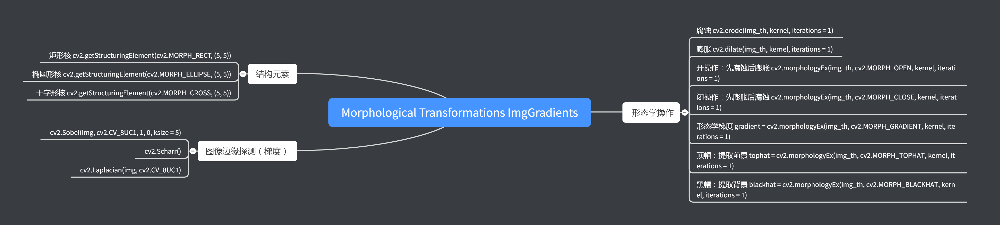

# Morphological Transformations ImgGradients

内容：

- openCV Python

版本：

- python 3.7.3

- openCV 4.1.0.25

官方文档：

- [tutorial](https://docs.opencv.org/3.1.0/d6/d00/tutorial_py_root.html)

知识点树：



## 0. 应用库的加载


```python
import cv2
import numpy as np
import matplotlib.pyplot as plt
import time

from ipywidgets import interact
```

## 1. 形态学操作

目标：

- 多种形态学操作：

    - 腐蚀，膨胀，开，闭等等
    
- 核心函数：

    - `cv2.erode()`
    
    - `cv2.dilate()`
    
    - `cv2.morphologyEx()`
    
### 原理

形态学操作是一些针对二值化图像，基于图像形状的简单的操作，需要两个参数输入：

- img

- 结构元素 or kernel

腐蚀和膨胀是两个最基本的形态学操作

### Erosion 腐蚀

- 基本的腐蚀思想就像泥土的腐蚀，它沿着边界腐蚀了前景对象（一定要把前景置为白色），腐蚀操作的实质是利用核滑遍整个图像，只有核下图像范围内所有的像素灰度都为1的时候，核下图像中心元素灰度值才能置为1，否则为0（被腐蚀了）

- 实际发生的事情就是所有的临近边界的像素会被腐蚀，灰度值变为0，腐蚀的范围取决于核的大小，所以前景图像的厚度和尺寸减小了（白色区域），这可以用于移除白色噪点，分离两个连接区域

Example:

- $5 \times 5$ kernel


```python
img = cv2.imread('img/liefeng.jpg',0)
blur = cv2.GaussianBlur(img,(5,5),0)
ret, th = cv2.threshold(blur,0,255,cv2.THRESH_BINARY_INV+cv2.THRESH_OTSU)

kernel = np.ones((5,5),np.uint8)
erosion = cv2.erode(th,kernel,iterations = 1)

fig = plt.figure()

plt.subplot(131),plt.imshow(img,'gray'),plt.title('Origin'),
plt.subplot(132),plt.imshow(th,'gray'),plt.title('Threshold')
plt.subplot(133),plt.imshow(erosion,'gray'),plt.title('Erosion 5x5')

fig.tight_layout()
plt.show()
```


### Dilation 膨胀

- 这是腐蚀的逆操作，核下的原图像素值至少有一个为1，则核下原图中心区域像素值为1，否则为0

- 这会使边缘的像素扩张


```python
img = cv2.imread('img/liefeng.jpg',0)
blur = cv2.GaussianBlur(img,(5,5),0)
ret, th = cv2.threshold(blur,0,255,cv2.THRESH_BINARY_INV+cv2.THRESH_OTSU)

kernel = np.ones((5,5),np.uint8)
dilation = cv2.dilate(th,kernel,iterations = 2)

fig = plt.figure()

plt.subplot(131),plt.imshow(img,'gray'),plt.title('Origin'),
plt.subplot(132),plt.imshow(th,'gray'),plt.title('Threshold')
plt.subplot(133),plt.imshow(dilation,'gray'),plt.title('Dilation 5x5')

fig.tight_layout()
plt.show()
```


### Opening 开操作

先腐蚀后膨胀，用于滤除噪点

- `cv2.morphologyEx()`


```python
img = cv2.imread('img/liefeng.jpg',0)

th = cv2.adaptiveThreshold(img,255,cv2.ADAPTIVE_THRESH_MEAN_C,\
            cv2.THRESH_BINARY_INV,9,3)

kernel = np.ones((5,5),np.uint8)
opening = cv2.morphologyEx(th, cv2.MORPH_OPEN, kernel)

fig = plt.figure()

plt.subplot(131),plt.imshow(img,'gray'),plt.title('Origin'),
plt.subplot(132),plt.imshow(th,'gray'),plt.title('AdaptiveTH M 9x9')
plt.subplot(133),plt.imshow(opening,'gray'),plt.title('Opening 5x5')

fig.tight_layout()
plt.show()
```


### Closing 闭操作

先膨胀后腐蚀

- 用于填充孔洞


```python
img = cv2.imread('img/liefeng.jpg',0)

th = cv2.adaptiveThreshold(img,255,cv2.ADAPTIVE_THRESH_MEAN_C,\
            cv2.THRESH_BINARY_INV,9,3)

kernel = np.ones((5,5),np.uint8)
closing = cv2.morphologyEx(th, cv2.MORPH_CLOSE, kernel)

fig = plt.figure()

plt.subplot(131),plt.imshow(img,'gray'),plt.title('Origin'),
plt.subplot(132),plt.imshow(th,'gray'),plt.title('AdaptiveTH M 9x9')
plt.subplot(133),plt.imshow(closing,'gray'),plt.title('Closing 5x5')

fig.tight_layout()
plt.show()
```


### Morphological Gradient（形态学梯度）

形态学梯度是膨胀操作后的图像减去腐蚀操作后图像的结果，一般用于得到轮廓

核心函数：

- `gradient = cv2.morphologyEx(img, cv2.MORPH_GRADIENT, kernel)`

公式：

- `gradient = dilate - erode`


```python
img = cv2.imread('img/liefeng.jpg',0)
blur = cv2.GaussianBlur(img,(5,5),0)
ret, th = cv2.threshold(blur,0,255,cv2.THRESH_BINARY_INV+cv2.THRESH_OTSU)

kernel = np.ones((5,5),np.uint8)
gradient = cv2.morphologyEx(th,cv2.MORPH_GRADIENT,kernel)

fig = plt.figure()

plt.subplot(131),plt.imshow(img,'gray'),plt.title('Origin'),
plt.subplot(132),plt.imshow(th,'gray'),plt.title('Threshold')
plt.subplot(133),plt.imshow(gradient,'gray'),plt.title('Gradient 5x5')

fig.tight_layout()
plt.show()
```


### Top Hat（顶帽操作）

原图与开操作之差(异或操作)，留下噪声，叫做顶帽操作，常用于背景提取，提取前景（黑色图像中的白点）


```python
img = cv2.imread('img/liefeng.jpg',0)

th = cv2.adaptiveThreshold(img,255,cv2.ADAPTIVE_THRESH_MEAN_C,\
            cv2.THRESH_BINARY_INV,9,3)

kernel = np.ones((5,5),np.uint8)
tophat = cv2.morphologyEx(th, cv2.MORPH_TOPHAT, kernel)

fig = plt.figure()

plt.subplot(131),plt.imshow(img,'gray'),plt.title('Origin'),
plt.subplot(132),plt.imshow(th,'gray'),plt.title('AdaptiveTH M 9x9')
plt.subplot(133),plt.imshow(tophat,'gray'),plt.title('Tophat 5x5')

fig.tight_layout()
plt.show()
```


### Black Hat（黑帽操作）

原图与闭操作返回图像的差（异或操作），常用于背景提取，提取背景（白色图像中的黑点）


```python
img = cv2.imread('img/liefeng.jpg',0)

th = cv2.adaptiveThreshold(img,255,cv2.ADAPTIVE_THRESH_MEAN_C,\
            cv2.THRESH_BINARY_INV,9,3)

kernel = np.ones((5,5),np.uint8)
blackhat = cv2.morphologyEx(th, cv2.MORPH_BLACKHAT, kernel)

fig = plt.figure()

plt.subplot(131),plt.imshow(img,'gray'),plt.title('Origin'),
plt.subplot(132),plt.imshow(th,'gray'),plt.title('AdaptiveTH M 9x9')
plt.subplot(133),plt.imshow(blackhat,'gray'),plt.title('Blackhat 5x5')

fig.tight_layout()
plt.show()
```


### Structuring Element（结构元素）

之前的结构元素是自己定义的，用np数组创建的矩形核，然而在有些情况中，可能会需要一个椭圆形或者圆形的核。

函数：

- `cv2.getStructuringElement()`

    - shape
    
    - size
    
Example:

- 矩形核

- 椭圆形核

- 十字形核


```python
cv2.getStructuringElement(cv2.MORPH_RECT,(5,5))
```


    array([[1, 1, 1, 1, 1],
           [1, 1, 1, 1, 1],
           [1, 1, 1, 1, 1],
           [1, 1, 1, 1, 1],
           [1, 1, 1, 1, 1]], dtype=uint8)


```python
cv2.getStructuringElement(cv2.MORPH_ELLIPSE,(5,5))  #无法改变形状
```


    array([[0, 0, 1, 0, 0],
           [1, 1, 1, 1, 1],
           [1, 1, 1, 1, 1],
           [1, 1, 1, 1, 1],
           [0, 0, 1, 0, 0]], dtype=uint8)


```python
cv2.getStructuringElement(cv2.MORPH_CROSS,(5,5))
```


    array([[0, 0, 1, 0, 0],
           [0, 0, 1, 0, 0],
           [1, 1, 1, 1, 1],
           [0, 0, 1, 0, 0],
           [0, 0, 1, 0, 0]], dtype=uint8)


### 高阶资料

- [Morphological Operations at HIPR2](http://homepages.inf.ed.ac.uk/rbf/HIPR2/morops.htm)

## 2. 图像梯度

目标：

- 寻找图像梯度，边缘

核心函数：

- `cv2.Sobel()`

- `cv2.Scharr()`

- `cv2.Laplacian()`

### 原理

OpenCV提供了三种类型的的梯度过滤器（高通滤波器），Sobel, Scharr 和 Laplacian

- Sobel and Scharr Derivatives（Sobel 和 Scharr 导数）

    - Sobel 操作是一个高斯平滑与差值操作的联合，所以可以更好的抵抗噪声，可以自定义方向（水平或者垂直），可以自定义核的尺寸，如果 ksize = -1，会采用 3x3 的 Scharr 滤波器，效果要好于 3x3 的 Sobel 滤波器。

- Laplacian Derivatives（拉普拉斯导数）

    - $\Delta src = \frac{\partial ^2{src}}{\partial x^2} + \frac{\partial ^2{src}}{\partial y^2}$ 每一个方向的梯度都是根据 Sobel 导数算出来的，如果 ksize = -1 核如下：
    
$$kernel = \begin{bmatrix} 0 & 1 & 0 \\ 1 & -4 & 1 \\ 0 & 1 & 0 \end{bmatrix}$$


```python
img = cv2.imread('img/liefeng.jpg',0)

laplacian = cv2.Laplacian(img,cv2.CV_8UC1)
ret, th_l = cv2.threshold(laplacian,0,255,cv2.THRESH_BINARY+cv2.THRESH_OTSU)
sobelx = cv2.Sobel(img,cv2.CV_8UC1,1,0,ksize=5)
ret, th_sx = cv2.threshold(sobelx,0,255,cv2.THRESH_BINARY_INV+cv2.THRESH_OTSU)
sobely = cv2.Sobel(img,cv2.CV_8UC1,0,1,ksize=5)
ret, th_sy = cv2.threshold(sobely,0,255,cv2.THRESH_BINARY_INV+cv2.THRESH_OTSU)


plt.subplot(2,2,1),plt.imshow(img,cmap = 'gray')
plt.title('Original'), plt.xticks([]), plt.yticks([])
plt.subplot(2,2,2),plt.imshow(th_l,cmap = 'gray')
plt.title('Laplacian'), plt.xticks([]), plt.yticks([])
plt.subplot(2,2,3),plt.imshow(sobelx,cmap = 'gray')
plt.title('Sobel X'), plt.xticks([]), plt.yticks([])
plt.subplot(2,2,4),plt.imshow(sobely,cmap = 'gray')
plt.title('Sobel Y'), plt.xticks([]), plt.yticks([])

plt.show()
```


### 数据类型

- 在梯度化的时候，有正的梯度，从黑色区域到白色区域，有负的梯度，从白色区域到黑色区域，而当采用`cv2.CV_8U` 或者 `np.uint8` 数据类型时所有的负值被转成了0，这意味着会丢失一半的边缘信息。

- 如果想检测出双向的边缘，更好的方式是将输出数据转为能储存负数的数据类型`cv2.CV_16S`, `cv2.CV_64F`，然后再绝对值化，转为数据类型 `cv2.CV_8U`

Example： 


```python
img = np.zeros((300,300),np.uint8)
cv2.rectangle(img,(75,75),(225,225),[255],-1)

# Output dtype = cv2.CV_8U
sobelx8u = cv2.Sobel(img,cv2.CV_8U,1,0,ksize=5)

# Output dtype = cv2.CV_64F. Then take its absolute and convert to cv2.CV_8U
sobelx64f = cv2.Sobel(img,cv2.CV_64F,1,0,ksize=5)
abs_sobel64f = np.absolute(sobelx64f)
sobel_8u = np.uint8(abs_sobel64f)

plt.subplot(1,3,1),plt.imshow(img,cmap = 'gray')
plt.title('Original'), plt.xticks([]), plt.yticks([])
plt.subplot(1,3,2),plt.imshow(sobelx8u,cmap = 'gray')
plt.title('Sobel CV_8U'), plt.xticks([]), plt.yticks([])
plt.subplot(1,3,3),plt.imshow(sobel_8u,cmap = 'gray')
plt.title('Sobel abs(CV_64F)'), plt.xticks([]), plt.yticks([])

plt.show()
```


